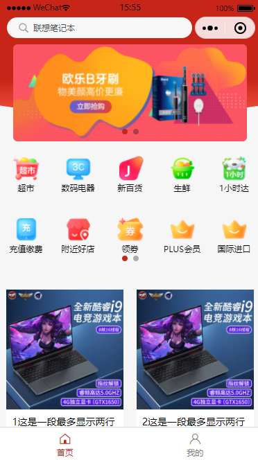
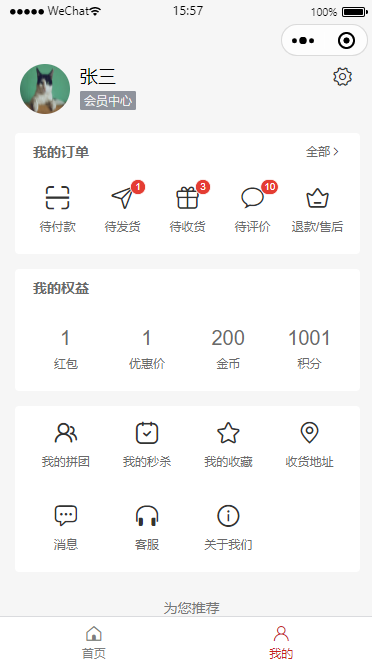
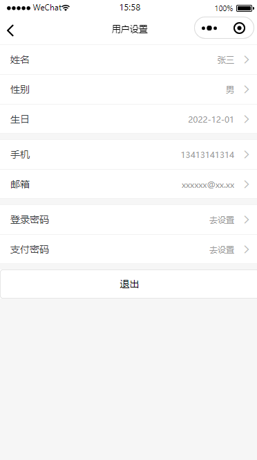
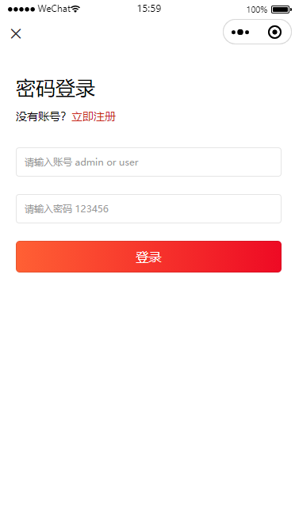
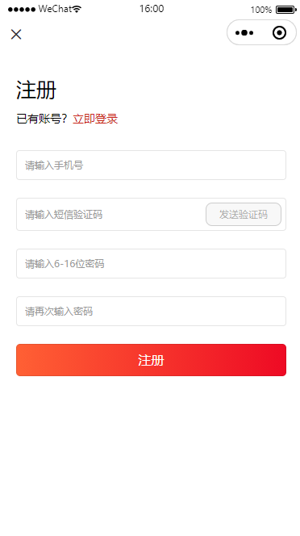

# template-uniui-uniapp

#### 介绍

`template-uniui-uniapp`（[Github](https://github.com/lqsong/template-uniui-uniapp)、[Gitee](https://gitee.com/lqsong/template-uniui-uniapp)） 是一个基于[uni-app](https://uniapp.dcloud.net.cn/) 、[uni-ui](https://uniapp.dcloud.net.cn/component/uniui/uni-ui.html)、[vue3](https://cn.vuejs.org/)、[pinia](https://pinia.vuejs.org/zh/) 的手机端前端解决方案。

#### 图片预览

|                 首页                              |  
| :-----------------------------------------------: |
| |

|                 我的                              |  
| :-----------------------------------------------: |
| |

|                 我的设置                           |  
| :-----------------------------------------------: |
| |

|                 登录                              |  
| :-----------------------------------------------: |
| |

|                 注册                              |  
| :-----------------------------------------------: |
| |


#### 目录结构

本项目已经为你生成了一个完整的开发框架，下面是整个项目的目录结构。

```bash
├── components                 # 全局组件目录
│   ├── tabbar                 # 自定义导航栏
│   └── tabbar-item
├── config                     # 全局配置目录
│   ├── enum.js                # 枚举配置
│   └── settings.js            # 站点配置
├── layouts                    # 全局布局组件目录([easycom规范](https://uniapp.dcloud.net.cn/collocation/pages.html#easycom))
│   └── layout-security        # 认证布局组件
├── pages                      # 页面目录
│   ├── index                  # 首页
│   ├── member                 
│   │   ├── index              # 我的页面
│   │   └── set                # 我的设置页面
│   └── user
│       ├── login              # 登录页面
│       └── register           # 注册页面
├── services                   # 全局数据请求目录
│   └── user.js                # 用户相关数据请求
├── static                     # 全局静态文件目录
│   ├── css                    # css文件目录
│   ├── img                    # 图片文件目录
│   └── temp                   # 临时文件目录(可删除)
├── stores                     # 全局状态管理目录
│   └── user.js                # 用户 store
├── uni_modules                # uni_modules插件目录([文档](https://uniapp.dcloud.net.cn/plugin/uni_modules.html#uni-modules))
├── utils                      # 全局工具函数目录
│   ├── is.js                  # 自定义 is 方法
│   ├── localToken.js          # 统一Token设置
│   ├── request.js             # 自定义 request 网络请求工具
│   └── trim.js                # trim 方法
├── .env.development           # 环境变量-开发模式
├── .env.production            # 环境变量-生产模式
├── .gitignore                 # Git忽略文件配置
├── App.vue                    # uni-app的主组件
├── index.html                 # html模板
├── main.js                    # uni-app 的入口文件
├── manifest.json              # 应用配置
├── package.json               # 项目信息
├── package-lock.json          # npm lock
├── pages.json                 # 页面路由
├── README.md                  # readme
├── uni.scss                   # uni.scss
└── vite.config.js             # vite 配置
```


#### 使用文档

- [uni-app官方文档](https://uniapp.dcloud.net.cn/)
- [uni-ui官方文档](https://uniapp.dcloud.net.cn/component/uniui/uni-ui.html)
- [vue3-hellouniapp demo](https://vue3-hellouniapp.dcloud.net.cn/)


#### 本地开发

1.  复制环境变量文件 `.env.development`，并命名为 `.env.development.local`，启用或修改里面的参数。
2.  安装依赖 `npm install`。
3.  打开 `HBuliderX` 开发工具，`文件` > `导入` > `从本地目录导入` > 选择本项目目录。
4.  配置 `manifest.json` 中的 DCloud `appid`。
5.  配置 `manifest.json` 中的 小程序 `appid` （如：在微信小程序运行需要先配置微信小程序AppID）。
6.  具体开发参照 `uni-app官方文档`。

#### 使用说明

1.  本项目基于 `uni-app`、`uni-ui`。
2.  开发工具 `HBuliderX` 版本 `>= 3.8.12`。
3.  前端构建工具使用的是 `vite`。
4.  vue版本固定为 `vue3`。
5.  状态管理使用的是 `Pinia`。


#### 框架模板

- frame-template-vue（[GitHub](https://github.com/lqsong/frame-template-vue)、[Gitee](https://gitee.com/lqsong/frame-template-vue)）

#### 后台前端解决方案列表

- admin-element-vue（[GitHub](https://github.com/lqsong/admin-element-vue)、[Gitee](https://gitee.com/lqsong/admin-element-vue)）
- admin-antd-vue（[GitHub](https://github.com/lqsong/admin-antd-vue)、[Gitee](https://gitee.com/lqsong/admin-antd-vue)）
- admin-antd-react（[GitHub](https://github.com/lqsong/admin-antd-react)、[Gitee](https://gitee.com/lqsong/admin-antd-react)）
- electron-admin-element-vue（[GitHub](https://github.com/lqsong/electron-admin-element-vue)、[Gitee](https://gitee.com/lqsong/electron-admin-element-vue)）
- electron-admin-antd-vue（[GitHub](https://github.com/lqsong/electron-admin-antd-vue)、[Gitee](https://gitee.com/lqsong/electron-admin-antd-vue)）
- electron-admin-antd-react（[GitHub](https://github.com/lqsong/electron-admin-antd-react)、[Gitee](https://gitee.com/lqsong/electron-admin-antd-react)）
- admin-vue3-micro-qiankun（[GitHub](https://github.com/lqsong/admin-vue3-micro-qiankun)、[Gitee](https://gitee.com/lqsong/admin-vue3-micro-qiankun)）

#### 前台前端解决方案列表

- template-vant-vue（[GitHub](https://github.com/lqsong/template-vant-vue)、[Gitee](https://gitee.com/lqsong/template-vant-vue)）
- template-uniui-uniapp（[Github](https://github.com/lqsong/template-uniui-uniapp)、[Gitee](https://gitee.com/lqsong/template-uniui-uniapp)）

#### 前台前端 SSR 解决方案列表

- midway-vue3-ssr（[GitHub](https://github.com/lqsong/midway-vue3-ssr)、[Gitee](https://gitee.com/lqsong/midway-vue3-ssr)）
- midway-react-ssr（[GitHub](https://github.com/lqsong/midway-react-ssr)、[Gitee](https://gitee.com/lqsong/midway-react-ssr)）


#### 捐赠

如果你觉得这个项目帮助到了你，请帮助点击 Star，你也可以请作者喝咖啡表示鼓励.

|                               **ALIPAY**                                |                             **WECHAT**                                     |
| :---------------------------------------------------------------------------------------: | :---------------------------------------------------------------------------------------: |
|  |  |